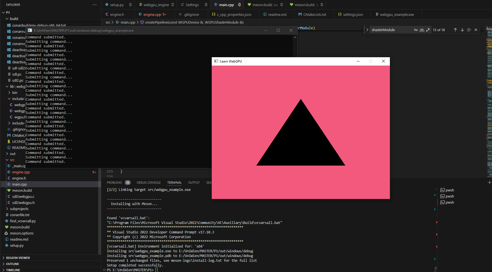

# Rendering a Triangle Using WebGPU in C++

## Table of Contents

- [Rendering a Triangle Using WebGPU in C++](#rendering-a-triangle-using-webgpu-in-c)
	- [Table of Contents](#table-of-contents)
	- [1. Introduction](#1-introduction)
	- [2. Tutorial Reference](#2-tutorial-reference)
	- [3. Choice of Build System](#3-choice-of-build-system)
	- [4. Custom Python Build Script](#4-custom-python-build-script)
	- [5. Browser Implementation and Future Steps](#5-browser-implementation-and-future-steps)
	- [6. Difficulties Encountered](#6-difficulties-encountered)
		- [Compiling on Windows with MinGW](#compiling-on-windows-with-mingw)
		- [Compiling on Windows with GCC](#compiling-on-windows-with-gcc)
		- [Issues with Clang as well as gcc and SDL2](#issues-with-clang-as-well-as-gcc-and-sdl2)
		- [Adjustments for Meson Build System](#adjustments-for-meson-build-system)
	- [7. Conclusion](#7-conclusion)
	- [8. Future Work](#8-future-work)
	- [9. Appendix](#9-appendix)

---

## 1. Introduction

Rendering graphics on the web using modern APIs like WebGPU is becoming increasingly popular due to its performance and cross-platform capabilities. This small paper explores the process of rendering a basic triangle using the WebGPU API in C++.

## 2. Tutorial Reference

A comprehensive tutorial provided by Elie Michel serves as the foundation for this project [LearnWebGPU](https://eliemichel.github.io/LearnWebGPU/). The tutorial covers essential concepts such as device initialization, shader compilation, and rendering pipeline setup and much more.

## 3. Choice of Build System

To manage dependencies and facilitate the building process, the Meson build system coupled with Conan package manager was choosen. Meson and Conan provide flexibility and simplicity, crucial for managing complex C++ projects with external dependencies.

## 4. Custom Python Build Script

A custom Python build script was developed to streamline the installation process across platforms. Currently, it supports one-click installation on Windows using Visual Studio's `cl.exe` compiler. Efforts are underway to extend this support to other platforms by allowing to choose the compiler as well as more options for the build (debug, release, emscripten, debug, ...).

## 5. Browser Implementation and Future Steps

While the project currently supports standalone SDL rendering, future work includes implementing a browser-based solution using Emscripten. This step aims to leverage WebGPU's capabilities directly within web browsers, enhancing accessibility and portability.

Since Meson release 0.52.0, it has included experimental support for WebGPU integration, which opens up possibilities for easier build management and integration within the project. This feature will be explored and implemented in future iterations to streamline the build process further.

## 6. Difficulties Encountered

### Compiling on Windows with MinGW

Challenges arose when attempting to compile using MinGW due to issues with libraries like `libiconv` [Conan Center Index Issue #506](https://github.com/conan-io/conan-center-index/issues/506).

### Compiling on Windows with GCC

Compiling on Windows using GCC, particularly with Mingw, presents challenges due to compatibility issues and specific compiler quirks. Issues such as [Conan Issue #2760](https://github.com/conan-io/conan/issues/2760) highlight difficulties in ensuring correct library linking and toolchain configuration, which are crucial for successful compilation.

### Issues with Clang as well as gcc and SDL2

Compiling with Clang encountered errors related to SDL2, specifically concerning invalid use of undefined types [LLVM Project Issue #44502](https://github.com/llvm/llvm-project/issues/44502).

### Adjustments for Meson Build System

The WebGPU with C++ tutorial primarily relies on CMake, necessitating adjustments to integrate Meson effectively into the project structure and build pipeline. Research had to be done in order to correctly integrate C++ WebGPU into the project.

## 7. Conclusion

Rendering a triangle using WebGPU in C++ involves navigating through various build system choices, addressing platform-specific compilation challenges, and planning for future expansions into browser-based implementations. This project highlights the complexities and advancements in modern graphics programming using web technologies and aims to provide  knowledge for further development.

## 8. Future Work

The future roadmap for this project includes:
- Implementing a one-click installation process for Windows and Linux, leveraging advancements in build systems like Meson and using packagemanagers like codec.
- Developing this project as a foundational framework for a WebGPU rendering engine that supports both SDL-based desktop applications and web-based implementations. This engine aims to provide a unified graphics rendering solution across different platforms, enhancing developer productivity and application portability.

## 9. Appendix
**A screenshot from the rendered triangle with SDL2.**

